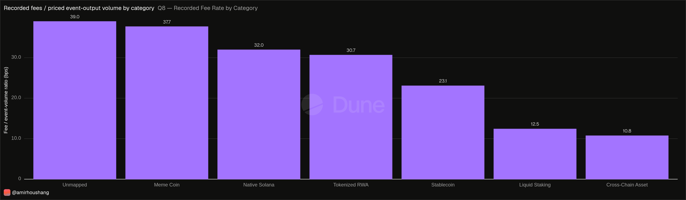
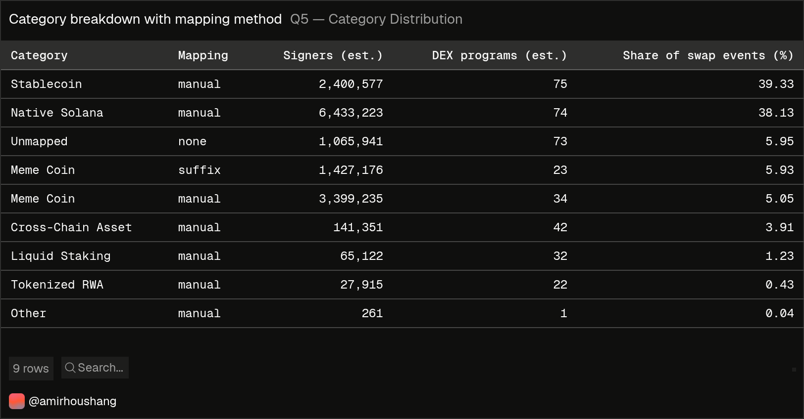
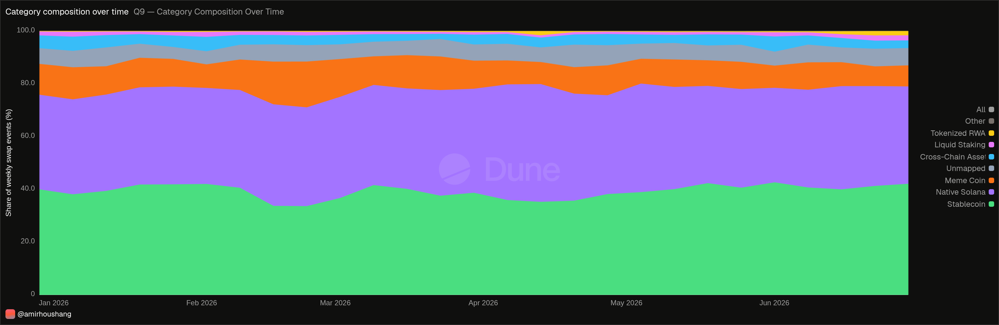

# What Solana Actually Trades — A Jupiter v6 Analysis

On-chain analysis of six months of trading through Jupiter, the routing layer of
the Solana DEX ecosystem. Built with SQL on Dune Analytics.

**Dashboard:** https://dune.com/amirhoushang/what-solana-actually-trades
**Period:** 1 January – 30 June 2026
**Data:** `jupiter_v6_solana.*`, `prices.day`, `tokens_solana.fungible` on Dune

---

## The question

> What is actually traded through Jupiter, how is it executed, and what fees are recorded?

Jupiter is not an exchange. It holds no liquidity of its own; it finds the best
path for a swap across the underlying AMM programs. That makes it a single
observation point for trading behaviour across the ecosystem rather than one venue.

## The finding

**Trade count, volume and recorded fees produce three different rankings.**

| Ranked by | Leader | Runner-up |
|---|---|---|
| Estimated transactions per output token | SOL — 153.9M | USDC — 120.7M |
| Priced swap-event output volume | **USDC — $82.9bn** | SOL — $76.1bn |
| Recorded fee ratio (classified categories) | **Meme Coin — 37.7 bps** | Native Solana — 32.0 bps |

*Unmapped is higher overall at 39.0 bps.*



*Recorded fees divided by priced swap-event output volume, on transactions with
at least one priced fee event and one priced swap event. These transactions are
0.12%–7.85% of each category's transactions (fee-event coverage in C2:
0.51%–7.92%), so the ranking describes recorded fee events, not the measured
cost of trading each category.*

Same six months, three different answers. Any dashboard that picks one of them
shows only part of the story.



*Share of trading activity by token category. `Mapping` shows whether a token was
verified manually or classified by mint suffix — 5.05 of the 11.0 percentage points
for meme coins are individually verified.*

Two results were not expected:

- **Stablecoin transactions carry the most events, meme coin transactions
  almost the fewest.** Transactions assigned to stablecoins average 1.55 events
  within their dominant category, meme coins 1.03. The initial hypothesis
  expected the opposite. Stablecoin outputs appear on about 75 of the 89 DEX
  programs, meme coin outputs on about 23–34. Whether that explains the gap, or
  whether orders are actually split for a better price, is not established by
  this data.
- **The two largest categories stayed dominant, but shares moved.**
  Stablecoins and native Solana assets together held 71.0–80.1% of weekly swap
  events. Individually: stablecoins 33.6–42.7%, native Solana 35.8–44.6%, meme
  coins 7.5–17.4% (C3). Native Solana ranked above stablecoins in 9 of 27 weeks.
  Six months is too short to tell a structural pattern from a reaction to
  market conditions.



*Weekly share of swap events per category. Each week sums to 100%, so shifts in
behaviour are visible independently of changes in overall market size.*

---

## Scale

| Metric | H1 2026 |
|---|---|
| Swap events | 465,238,625 |
| Distinct transactions | 267,562,076 |
| Distinct signers | 7,970,524 |
| DEX programs used | 89 |
| Distinct output tokens | 1,074,350 |

---

## How the project was built

This section documents the actual process, including the wrong turns. The
finished queries do not show how they were arrived at.

### 1. The starting point was too vague

The project began as "analyse the Solana ecosystem through Jupiter" — roughly
ten exploratory queries and no central question. The first real work was
narrowing that to a thesis that the data could confirm or refute: *trade count,
volume and cost tell three different stories*.

### 2. Jupiter was not where it was expected to be

The obvious approach was `dex_solana.trades`, Dune's curated DEX table. Filtering
for `project = 'jupiter'` returned zero rows.

A scan of all projects in that table (Q0) showed why: Jupiter is an aggregator,
so the trades it routes are recorded under the executing AMM programs — PumpSwap,
HumidiFi, Orca Whirlpool, Meteora — not under Jupiter. Working with Jupiter means
using decoded protocol events rather than the curated table.

This turned an obstacle into the opening finding of the dashboard.

### 3. The raw data had traps

`jupiter_v6_solana.jupiter_evt_swapevent` is raw event data, not a cleaned table.
Four problems surfaced, each costing time:

- **Duplicate columns.** Both `inputMint`/`input_mint` and `inputAmount`/`input_amount`
  exist. For 2026 only the snake_case ones are populated; the camelCase ones
  silently return zero. The first version of Q1 reported 0 distinct tokens
  because of this.
- **`amm` is a program, not a pool.** The first assumption was that it identified
  individual liquidity pools. A check of distinct output tokens per address
  showed only 89 values, some serving tens or hundreds of thousands of tokens
  — DEX programs, not pools. Two planned queries had to be rewritten.
- **No USD values.** Amounts are raw integers in token units. Volume required
  `/ POWER(10, decimals)` plus a price join.
- **Different address formats.** `prices.day` stores Solana mints as bytes while
  the event tables use base58 strings. `from_base58()` bridges them.

### 4. Metadata could not be trusted

`tokens_solana.fungible` turned out unreliable in two distinct ways:

- Some rows are missing entirely — bSOL has no symbol and no name.
- Others hold values frozen at first mint. PENGU (Pudgy Penguins, $542m market
  cap) is still labelled `test`. Moonbirds still shows as `SPLT`.

Every one of the top 105 tokens was therefore verified manually via Solscan.
This is why the categorisation runs on mint addresses and never on symbols.

### 5. An impostor token in the top 100

Mint `Es9vdPD6sXzHhbAskU19WFnAtyRo94HKrGrPSdQ3aSSB` is named "USD Tether" with
symbol "USDT" — but it is not USDT. The real one is `Es9vMFrza...`; both begin
with `Es9v`.

Checks on Solscan: unverified, created five months earlier, 3.49bn supply across
only 928 holders, no working price feed. It recorded 173,258 swap events in
173,100 transactions, then a single sell took the price from $1.00 to $0.0008
within minutes. 24h volume at time of checking: $1.56.

It is classified `Other` and carries `flag = 'impostor'` — kept in the dataset so
it can be reported, excluded from stablecoin figures so it cannot distort them.
Deleting it would have hidden a real finding.

### 6. Scope had to be justified, not assumed

Over a million distinct tokens were traded in the period. Categorising all of
them is impossible; picking an arbitrary cutoff is unscientific.

A coverage check (C1) settled it: the top 100 tokens cover **88.1%** of all swap
events, the top 500 only **91.9%**. Four hundred more tokens for 3.8 percentage
points is not worth the manual effort. Beyond the top 100, launchpad tokens are
caught by mint suffix (`pump`, `bonk`), and everything remaining is reported as
`Unmapped` — 5.9% of events, visible rather than hidden.

A `mapping_method` column distinguishes manually verified rows from rule-based
ones, so the share of the classification that was actually checked is visible.

### 7. Performance forced compromises

Exact `COUNT(DISTINCT ...)` on 465 million rows times out after two minutes.
`approx_distinct()` replaced it where needed — roughly 2% error, irrelevant for
rankings, and disclosed everywhere it is used.

One consequence surfaced later: at small counts the approximation produced an
impossible value (0.95 legs per swap, when the minimum is 1.0). That was the
signal that Q7 was also counting at the wrong grain — transactions touching
several categories were counted more than once. Restructuring it to assign each
transaction to a single category fixed both problems, and the result became
sharper: the stablecoin–meme coin gap widened from 1.30 vs 1.02 to 1.55 vs 1.03.

### 8. A metric that came from trading, not from the data

The routing complexity measure (Q7) did not come from the tables. It came from a
wrapped BTC purchase where Jupiter had pulled the token from three separate
pools — one action for the user, three events on chain.

That observation became a metric: swap events per transaction within the
dominant category. It is the part of this project least likely to appear in a
tutorial. The result did not support the hypothesis behind it, and the metric
turned out not to measure liquidity fragmentation directly, which made it more
interesting rather than less.

---

## Method

**Categorisation.** Seven categories across 105 manually verified tokens:
Native Solana, Liquid Staking, Stablecoin, Cross-Chain Asset, Meme Coin,
Tokenized RWA, Other. Two rules worth stating:

- WSOL is Native Solana, not Cross-Chain — it is the SPL wrapper of SOL, not a
  bridged asset.
- Solana-native protocol tokens (JUP, RAY, ORCA, KMNO) count as Native Solana
  rather than a separate DeFi category, which would overlap almost entirely.

**Dimension tables.** Q4 (tokens → categories) and Q6b (program addresses →
names) are separate queries joined by the analysis queries — the same principle
as a `dim_asset` table in a star schema, applied to on-chain data.

**Counting.** Event-level and transaction-level counts answer different questions
and are labelled as such throughout. Where a transaction touches several
categories, the treatment is stated per query.

---

## Queries

| ID | Title | Role |
|---|---|---|
| Q0 | Solana DEX Landscape | Context; establishes Jupiter's absence |
| C1 | Coverage Check | Justifies the top-100 scope |
| C2 | Fee Event Coverage | Fee-event coverage per category (Q8 uses a smaller priced subset) |
| C3 | Weekly Range | Min/max weekly share per category, from Q9 |
| Q1 | Baseline Metrics | Headline figures |
| Q2 | Top Tokens by Trade Count | Ranking by activity |
| Q3 | Top Tokens by USD Volume | Ranking by capital |
| Q4 | Token Category Mapping | Dimension table, 105 tokens |
| Q5 | Category Distribution | Share of activity per category |
| Q6 | DEX Program Usage | Execution venues |
| Q6b | DEX Program Names | Dimension table, 20 programs |
| Q7 | Routing Complexity by Category | Dominant-category events per transaction |
| Q8 | Recorded Fee Rate | Recorded fees / priced event-output volume, on a priced subset |
| Q9 | Category Composition Over Time | Weekly shares |

Chart variants (Q2a/b, Q3a/b, Q5a, Q6c/e) exist because the distributions are too
skewed for a single readable chart. They add no logic of their own.

---

## Limitations

- Six months of data. Findings are period-specific and not generalisable.
- Only Jupiter v6. Direct pool swaps and other aggregators are out of scope —
  the aggregator is itself a filter on what is observed.
- Categorisation is an analytical judgement, not an official taxonomy. It is
  published as Q4 and can be checked line by line.
- `Unmapped` covers 5.9% of swap events and is always reported.
- `approx_distinct()` is used where exact counts time out. Roughly 2% error; at
  small counts an estimate can exceed the exact event count.
- **Price coverage is uneven:** 100% for liquid staking, 89% for native Solana,
  82% for stablecoins, 67% for cross-chain and RWA, but only **24% for meme
  coins**. Meme coin volume and fees are understated throughout.
- Prices are daily closes, not execution-time prices. Adequate for ranking, not
  for precise valuation.
- **Intermediate hops are counted as outputs.** A route A → SOL → B records SOL
  as an output alongside B. Category shares therefore describe execution
  activity, not what traders set out to acquire. Stablecoin and native Solana
  shares are likely inflated by this, by an amount not measured here.
- **Fee event coverage is narrow and uneven.** Jupiter does not record a fee
  event on every route. The share of transactions carrying one ranges from 7.92%
  (Native Solana) to 0.51% (Cross-Chain Asset), with none at all for Other — see
  C2. After pricing filters, Q8 uses 0.12%–7.85% of transactions. Q8 therefore describes recorded fee events, not the cost of trading a
  category. Whether the covered subset is representative cannot be established
  from this data.
- Fees recorded in `jupiter_evt_feeevent` are referred to here as recorded fee
  events. Who ultimately receives them is not established by this analysis.
- Solana network fees are a separate cost and are not analysed here. The two are
  never combined.
- `avg_size_usd` in Q3 is computed per priced swap event, not per transaction.
- Of the top 20 DEX programs, only Manifest carries a verified-program badge on
  Solscan. Names come from public labels.
- Wash trading and bot activity are real on DEXes and cannot be fully filtered.
- The analysis describes trading behaviour, not its causes. No causal claims.
- Not investment advice.

---

## Use of AI

This project was built with an AI assistant (Claude), and it is worth being
precise about what that means rather than leaving it vague.

**What the AI did:**

- Wrote most of the SQL, including the window functions, CTEs and joins
- Explained unfamiliar functions (`approx_distinct`, `from_base58`, `PARTITION BY`)
- Suggested the query structure and the order of work
- Diagnosed errors — the duplicate-column trap, the type mismatch on the price
  join, the wrong counting grain in the first version of Q7
- Drafted the dashboard text and this README

**What the AI did not do:**

- Choose the research question or the thesis
- Decide the category boundaries, or which of several defensible options to take
- Verify the 105 tokens on Solscan
- Notice that a token labelled `test` in Dune was actually PENGU, or that a
  "USDT" in the top 100 was an impostor
- Produce the routing complexity idea, which came from an observation while
  trading, not from the data
- Judge which findings mattered

An AI generating a query is easy. Knowing that the number it returns is wrong,
and why, is not — the impossible 0.95 value in Q7 was caught because the result
contradicted what the metric could mathematically be, not because the SQL threw
an error.

The tooling changes how fast this gets built. It does not change who is
responsible for whether it is right.

---

## Repository

```
solana-jupiter-trading-analysis/
├── README.md
├── REPORT.md
├── images/
│   ├── category_breakdown.png
│   ├── category_over_time.png
│   ├── dex_programs_table.png
│   ├── fee_rate_by_category.png
│   ├── routing_complexity.png
│   ├── top5_by_trade_count.png
│   ├── top5_by_volume.png
│   └── top5_dex_programs.png
└── queries/
    ├── Q0_solana_dex_landscape.sql
    ├── C1_coverage_check.sql
    ├── C2_fee_event_coverage.sql
    ├── C3_weekly_range.sql
    ├── Q1_baseline_metrics.sql
    ├── Q2_top_tokens_by_trade_count.sql
    ├── Q2a_top5_by_trade_count.sql
    ├── Q2b_ranks_6_15_by_trade_count.sql
    ├── Q3_top_tokens_by_volume.sql
    ├── Q3a_top5_by_volume.sql
    ├── Q3b_ranks_6_15_by_volume.sql
    ├── Q4_token_category_mapping.sql
    ├── Q5_category_distribution.sql
    ├── Q5a_category_distribution_chart.sql
    ├── Q6_dex_program_usage.sql
    ├── Q6b_dex_program_names.sql
    ├── Q6c_top5_dex_programs.sql
    ├── Q6e_dex_programs_table.sql
    ├── Q7_routing_complexity.sql
    ├── Q8_recorded_fee_rate.sql
    └── Q9_category_composition_over_time.sql
```

Each query file is self-contained: the header comments state purpose, scope,
counting method and known caveats. The file contents are identical to what runs
on Dune.

The CSV exports of the query results are in the repository alongside the
queries.

**Detailed findings:** [REPORT.md](REPORT.md) — every result walked through with
the charts, including what was found along the way and what would come next.
