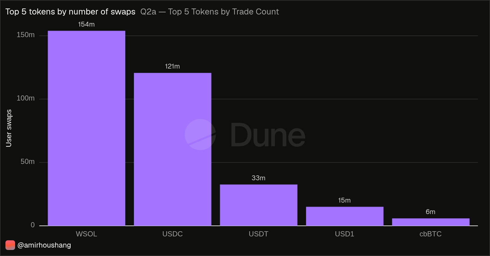
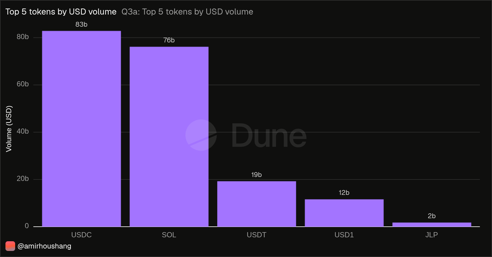
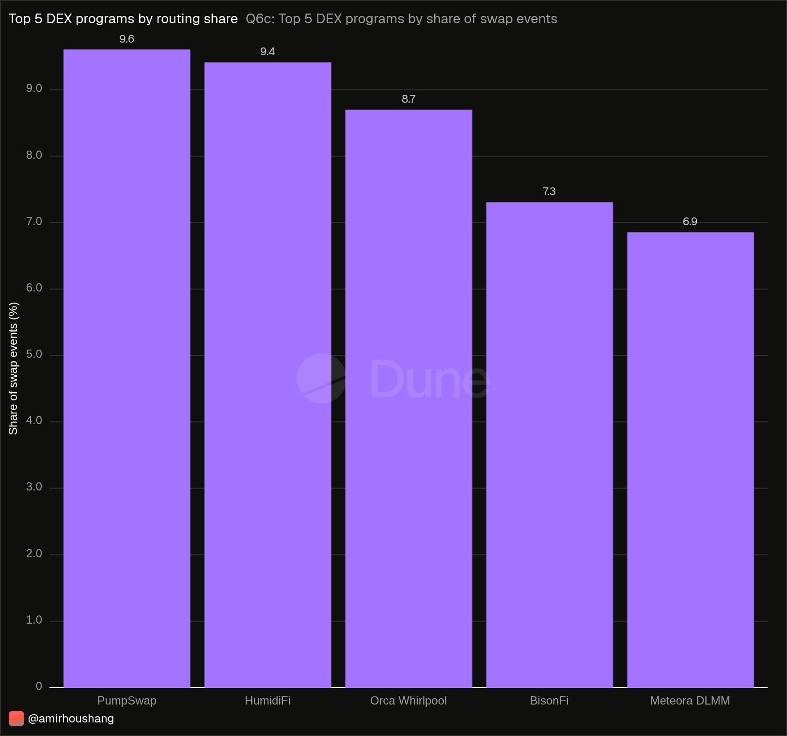
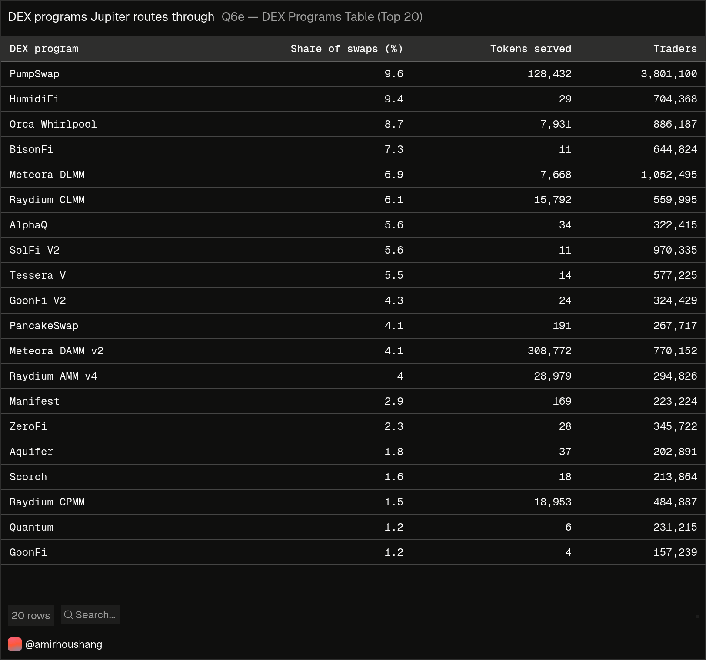
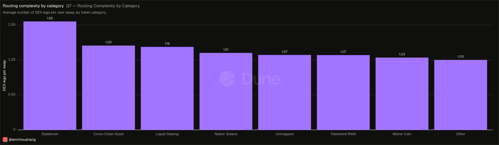
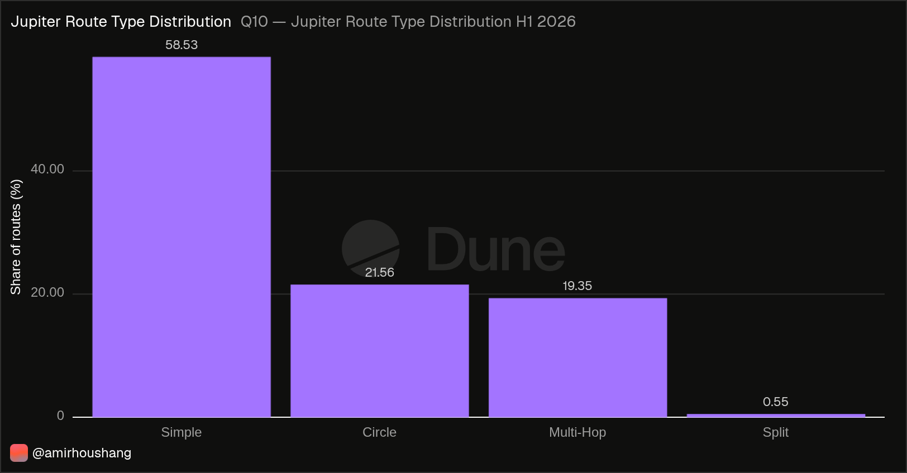
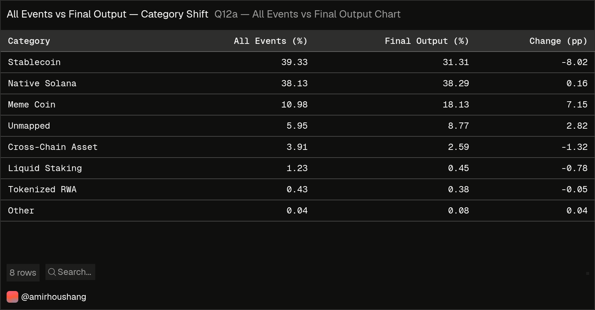
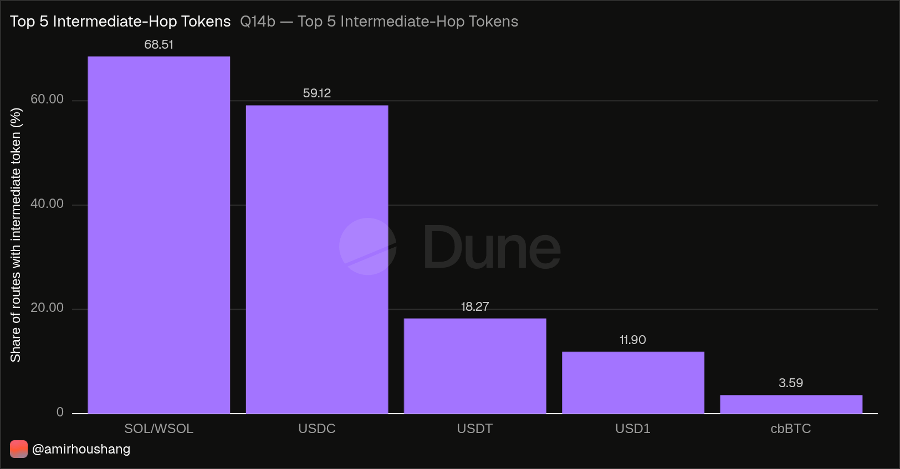

# Detailed Findings

A full walk-through of the analysis behind
[What Solana Actually Trades](https://dune.com/amirhoushang/what-solana-actually-trades).
The [README](README.md) covers the summary and the method; this document goes
through each result in turn.

**Period:** 1 January – 30 June 2026
**Source:** `jupiter_v6_solana.*` on Dune Analytics

The project now has two analytical layers. Part 1 measures swap-event execution.
Part 2 reconstructs Jupiter route groups to separate final outputs from
intermediate routing tokens.

---

## 1. Scale

| Metric | H1 2026 |
|---|---|
| Swap events | 465,238,625 |
| Distinct transactions | 267,562,076 |
| Distinct signers | 7,970,524 |
| DEX programs used | 89 |
| Distinct output tokens | 1,074,350 |

The gap between the first two rows is the first result of the project. One
transaction can contain several swap events — split across venues or routed
through intermediate tokens. 465 million events fall into 268 million
transactions — **1.74 events per transaction on average**.

Every figure in this report is labelled as either event-level or
transaction-level, because the two answer different questions. Event counts
measure execution activity. Transaction counts measure distinct transactions;
neither a transaction nor a signing address is necessarily one user order or
one person.

Over a million distinct tokens appeared as a swap output in six months,
including intermediate routing tokens. That number alone says
something about the composition of the ecosystem before any categorisation
begins.

---

## 2. What is traded — two rankings that disagree

### By number of transactions

| Rank | Token | Estimated transactions |
|---|---|---|
| 1 | SOL (WSOL) | 153,912,777 |
| 2 | USDC | 120,696,657 |
| 3 | USDT | 32,636,451 |
| 4 | USD1 | 15,062,058 |
| 5 | cbBTC | 5,921,906 |

The top four are SOL and three stablecoins. Position five drops to under
6 million — a factor of 26 below the leader. The distribution is extremely
skewed, which is why the charts in this project are split rather than crammed
into one axis. Transaction counts are `approx_distinct` estimates (~2% error);
ranks are ordered by exact swap events.

### By priced swap-event output volume

| Rank | Token | Volume |
|---|---|---|
| 1 | **USDC** | $82.9bn |
| 2 | SOL | $76.1bn |
| 3 | USDT | $19.2bn |
| 4 | USD1 | $11.6bn |
| 5 | JLP | $1.8bn |

**The leader changes.** USDC leads priced event-output volume despite about 33
million fewer transactions. This volume includes intermediate hops, so it is
execution volume, not final user-order value. The same six months of data, a different question, a different
answer.

### Why: average priced swap-event size

| Token | Average priced event |
|---|---|
| jlJupUSD | $16,657 |
| CASH | $1,818 |
| USX | $933 |
| USD1 | $764 |
| USDC | $651 |
| SOL | $476 |
| Fartcoin | $91 |
| PENGU | $77 |
| BONK | $50 |
| RAY | $25 |

The spread is wide. jlJupUSD recorded only 6,013 priced swap events in six
months but averaged **$16,657 each**. At the other end, RAY averages $25 across
588,703 events. Nearly three orders of magnitude between them, routed through
the same aggregator in the same six months. What kind of participant sits behind
each is not something this data answers.

This figure is computed per priced swap event, not per transaction. Split
orders produce several smaller events; multi-hop routes produce several events
of similar value. The figure is therefore not directly comparable to the size of
a user order.

Neither ranking is wrong. Trade count measures how frequently a token appears
as an output; volume measures priced event-output value. A dashboard that shows
only one of them shows only part of the story.

---

## 3. What kind of asset — categorisation

105 tokens were classified manually into seven categories, verified individually
on Solscan. Tokens beyond that set are matched by mint suffix (`pump`, `bonk`)
where possible; the remainder is reported as `Unmapped`.

| Category | Share of swap events | Signers (est.) | DEX programs (est.) |
|---|---|---|---|
| Stablecoin | 39.33% | 2,400,577 | 75 |
| Native Solana | 38.13% | 6,433,223 | 74 |
| Unmapped | 5.95% | 1,065,941 | 73 |
| Meme Coin (suffix) | 5.93% | 1,427,176 | 23 |
| Meme Coin (manual) | 5.05% | 3,399,235 | 34 |
| Cross-Chain Asset | 3.91% | 141,351 | 42 |
| Liquid Staking | 1.23% | 65,122 | 32 |
| Tokenized RWA | 0.43% | 27,915 | 22 |
| Other | 0.04% | 261 | 1 |

Three observations.

**Stablecoins and native Solana assets are 77% of all swap events.** The ecosystem
that gets written about — meme coins, launchpads — is 11% of the trading.

One qualification on that figure: categories are assigned from the output token
of each swap event, and a route A → SOL → B records SOL as an output alongside B.
The shares therefore describe execution activity rather than final route outputs.
Part 2 measures this difference directly instead of assuming its size.

**Meme coins reach more distinct wallets than stablecoins.** The manually
verified meme coin group alone records 3.4 million distinct signers against 2.4
million for stablecoins, with about an eighth of their swap events. The
suffix-matched group adds a further 1.4 million, but the two groups may overlap,
so they are not summed here. Distinct signers are wallet addresses, not
necessarily distinct people. The average event sizes above are per token
(e.g. Fartcoin $91), not category averages, so they do not establish a
category-level size pattern.

**Meme coins appear on far fewer venues.** 23 and 34 DEX programs, against 75
for stablecoins (estimates). Section 5 discusses whether this relates to the
routing result; the data does not establish it.

The `Mapping` column is deliberate. It shows how much of the classification was
individually verified (`manual`) and how much rests on a rule (`suffix`).
5.05 of the 11.0 percentage points for meme coins are checked token by token;
the rest is inferred from the mint address. Stating that is more useful than a
single combined number.

`Unmapped` at 5.95% is the long tail the classification does not reach. It is
reported rather than folded into another category.

---

## 4. Where it executes

Jupiter routed through **89 different DEX programs**. No venue dominates: the
largest, PumpSwap, carries 9.6% of swap events, and the top five together reach
41.9%.

The interesting column is `Tokens served` — distinct output tokens,
`approx_distinct` estimate.

| Program | Share of swap events | Tokens served |
|---|---|---|
| PumpSwap | 9.6% | 128,432 |
| HumidiFi | 9.4% | **29** |
| Orca Whirlpool | 8.7% | 7,931 |
| BisonFi | 7.3% | **11** |
| Meteora DLMM | 6.9% | 7,668 |
| Meteora DAMM v2 | 4.1% | 308,772 |
| SolFi V2 | 5.6% | **11** |

Two very different profiles sit next to each other in this table.

**HumidiFi serves 29 tokens and carries 9.4% of swap events.** BisonFi serves 11
tokens for 7.3%. SolFi V2 serves 11 for 5.6%. A large event share is
concentrated on very few output tokens.

**PumpSwap serves 128,432 tokens for 9.6%.** Meteora DAMM v2 serves 308,772 for
4.1%. Here the event share is spread across a very large number of tokens.

Q6 shows token breadth and event share only. It does not measure liquidity
depth or per-token USD volume, so it does not show which venue provides depth.

One caveat worth stating: of these top 20 programs, only Manifest carries a
verified-program badge on Solscan. A missing badge is not in itself a security
assessment. The names in this table come from Solscan's public labels.

---

## 5. Routing complexity — the hypothesis was not supported

This metric did not come from the data. It came from a trade: a single wrapped
BTC purchase where Jupiter pulled the token from three separate pools. One
action for the user, three events on chain.

Formalised: **swap events per transaction, by category.** Each transaction is
assigned to one category — the one with the most swap events in it, ties broken
alphabetically — and only the events of that category are counted. The figure is
therefore events within the dominant category per transaction, not the full leg
count of every transaction.

The expectation was that meme coins, with scattered liquidity, would force more
splitting.

| Category | Dominant-category events per transaction |
|---|---|
| **Stablecoin** | **1.55** |
| Cross-Chain Asset | 1.20 |
| Liquid Staking | 1.19 |
| Native Solana | 1.10 |
| Unmapped | 1.07 |
| Tokenized RWA | 1.07 |
| Meme Coin | 1.03 |
| Other | 1.00 |

The result is the opposite of the hypothesis. Stablecoin-assigned transactions
carry the most dominant-category events, meme-coin-assigned transactions almost
the fewest (only Other is lower).

Section 4 offers a possible explanation. Stablecoins appear across 75 of the 89
DEX programs, meme coins across 23 to 34. Note that these are programs, not
individual pools — pool-level detail is not available in this table.

One hypothesis for this is that where more venues exist, Jupiter has more to
split across, and splitting can yield a better price. The data here is
consistent with that but does not establish it — unused routing options are not
observable in this dataset, and the query examines neither route ordering nor
whether a split improved execution.

What can be said is narrower: transactions assigned to the stablecoin category
carry more swap events within that category than transactions assigned to meme
coins. The metric was designed to measure liquidity fragmentation and does not
do that.

Part 2 later reconstructs route groups directly. That does not invalidate Q7:
Q7 remains an event-per-transaction metric, while Q10–Q14 answer route-level
questions that Q7 was not designed to answer.

A note on how this was caught: the first version of the query returned 0.95 legs
per swap for one category. That is mathematically impossible — the minimum is
1.0. The impossible value exposed a counting error: transactions touching
several categories were being counted more than once. Assigning each transaction
to a single category fixed it, and sharpened the result. The stablecoin–meme
coin gap widened from 1.30 vs 1.02 to 1.55 vs 1.03.

---

## 6. What it costs — read the coverage first

Absolute fees follow category size, so they compare nothing. Fee per dollar of
volume does — but only within a limit that has to be stated before the numbers.

**Jupiter does not record a fee event on every route.** The share of transactions
that carry one varies sharply by category:

| Category | Transactions | With fee event | Coverage |
|---|---|---|---|
| Native Solana | 118,460,887 | 9,385,313 | 7.92% |
| Liquid Staking | 3,370,006 | 78,233 | 2.32% |
| Unmapped | 16,355,364 | 253,016 | 1.55% |
| Tokenized RWA | 573,675 | 8,847 | 1.54% |
| Stablecoin | 68,525,537 | 930,935 | 1.36% |
| Meme Coin | 46,677,517 | 302,363 | 0.65% |
| Cross-Chain Asset | 13,425,990 | 68,801 | 0.51% |
| Other | 173,100 | 0 | 0% |

A factor of fifteen between the widest and narrowest coverage (Other excluded).
Q8 applies additional pricing filters, so the transactions actually used are
smaller still: 0.12%–7.85% of each category (Meme Coin 0.31%, Stablecoin 1.34%).

| Category | Fee rate (bps) | Total fees | Volume | Transactions |
|---|---|---|---|---|
| Unmapped | 39.00 | $36,273 | $9.3M | 19,278 |
| **Meme Coin** | **37.73** | $113,433 | $30.1M | 146,437 |
| Native Solana | 32.01 | $602,461 | $188.2M | 9,304,745 |
| Tokenized RWA | 30.71 | $536 | $174,612 | 6,581 |
| Stablecoin | 23.13 | $602,866 | $260.6M | 916,364 |
| Liquid Staking | 12.48 | $8,802 | $7.1M | 41,148 |
| Cross-Chain Asset | 10.82 | $15,895 | $14.7M | 64,656 |

Among transactions where a fee was recorded, meme coins show the highest rate of
the classified categories at 37.7 basis points, against 23.1 for stablecoins and
10.8 for cross-chain assets. That is a factor of 1.6 and 3.5 respectively.

**What this does and does not say.** It says that on the covered transactions,
the fee rate differs by category in that direction. It does not say that trading
meme coins costs 1.6× more than trading stablecoins — for that, the covered
subset would have to be representative of each category, and representative to a
similar degree across categories. With Q8 inclusion ranging from 0.12% to 7.85%,
neither can be established from this data.

The ranking is an observation about recorded fee events. It is not a measured
cost of trading.

### How this section was rebuilt

The first version of this query was wrong in a way that was not visible in the
output. It categorised fees by the fee token and volume by the output token,
independently, then joined the two on category name alone.

A check revealed that those two categorisations disagree in roughly three
quarters of cases. The single largest group was *fee paid in a stablecoin on a
SOL purchase* — 137,033 pairs in a one-day sample, against 33,882 where both
sides agreed. The fee token is often not the output token of the swap.

The consequence: the stablecoin fee figure was largely composed of fees from
native Solana trades. The ratio described nothing coherent.

The rebuilt version assigns each transaction to one category — the one with the
most swap events in it, as in Q7 — and counts both its fees and its volume
towards that category. The numbers changed substantially. The gap between meme
coins and stablecoins narrowed from a factor of 6.4 to 1.6.

Both the error and the correction are in the repository. The earlier figures
should not be cited.

---

## 7. Over time — dominant, but not static

Weekly shares across H1 2026 (C3, 27 weeks incl. partial first and last week):

| Category | Min weekly share | Max weekly share |
|---|---|---|
| Stablecoin | 33.6% | 42.7% |
| Native Solana | 35.8% | 44.6% |
| Meme Coin | 7.5% | 17.4% |
| Unmapped | 4.5% | 8.5% |
| Cross-Chain Asset | 2.0% | 5.8% |
| Liquid Staking | 0.7% | 2.0% |
| Tokenized RWA | 0.2% | 1.7% |

Stablecoins and native Solana assets together held 71.0–80.1% of weekly swap
events, so the two largest categories stayed dominant throughout. Their
individual shares moved noticeably: native Solana ranked above stablecoins in 9
of 27 weeks, and the meme coin share more than doubled between its lowest and
highest week, peaking in the second half of February.

The chart describes execution activity and does not explain these changes. Six
months is too short to tell a structural pattern from a reaction to market
conditions; a longer window is the obvious next step.

---

## 8. Part 2 — final outputs versus intermediate routing

Part 1 counts every swap-event `output_mint`. That is the right grain for
execution activity, but it does not distinguish a token received at the end of a
route from one used only as an intermediate hop. Part 2 was built to make that
distinction explicit.

### 8.1 The route grain had to be established first

The route key used here is:

`(evt_tx_id, evt_outer_instruction_index)`

C4 inspected decoded Jupiter events and confirmed that the outer instruction
index separates Jupiter invocations inside a transaction. One sampled
transaction, for example, contains route groups at outer instruction indices 4
and 5 rather than one undifferentiated transaction-level route.

C5 then checked how often this matters over the test week
**2–9 March 2026**:

| Route groups in transaction | Transactions | Share |
|---:|---:|---:|
| 1 | 10,097,262 | 90.91% |
| 2 | 1,009,231 | 9.09% |
| 3 | 39 | 0.00% |
| 4 | 4 | 0.00% |

Most transactions contain one route group, but more than nine percent contain
two. Treating one transaction as one Jupiter route would therefore merge
distinct executions in a material number of cases.

### 8.2 Final output is inferred from token roles

For each route group, every mint is reduced to whether it appears as an input,
an output, or both:

- input but never output → start token
- input and output → intermediate token
- output but never input → final output token
- no output-only token → circular / closed route

This is a set-based definition. It does not require an assumption about decoded
event order.

### 8.3 Route types

Q10 classifies all **284,716,882** H1 route groups with an operational,
precedence-based rule: a route is `Circle` when it has no final token; a
one-event route is `Simple`; repeated use of an input or output token is
classified as `Split`; a remaining route with an intermediate token is
`Multi-Hop`; everything else is `Simple`.

| Route type | Route groups | Share |
|---|---:|---:|
| Simple | 166,652,857 | 58.53% |
| Circle | 61,396,063 | 21.56% |
| Multi-Hop | 55,103,293 | 19.35% |
| Split | 1,564,669 | 0.55% |

The labels describe event structure, not motive. In particular, `Circle` means
that no output-only token exists under this role definition. It does **not**
establish that the route was arbitrage.

### 8.4 What changes when only final outputs are counted

Q11 applies the same Q4 token mapping to output-only tokens. Circular routes do
not enter this distribution because they have no final output under the
definition above.

| Category | Mapping | Final-output observations | Share |
|---|---|---:|---:|
| Native Solana | manual | 85,509,023 | 38.29% |
| Stablecoin | manual | 69,913,352 | 31.31% |
| Meme Coin | suffix | 24,575,948 | 11.00% |
| Unmapped | unmapped | 19,592,386 | 8.77% |
| Meme Coin | manual | 15,924,132 | 7.13% |
| Cross-Chain Asset | manual | 5,773,455 | 2.59% |
| Liquid Staking | manual | 1,005,525 | 0.45% |
| Tokenized RWA | manual | 855,331 | 0.38% |
| Other | manual | 173,207 | 0.08% |

The total is **223,322,359 final-output-token observations**.

Q12 puts these numbers beside the Part 1 event-output shares. For readability,
the two meme-coin mapping methods are combined here:

| Category | All event outputs | Final output | Change |
|---|---:|---:|---:|
| Stablecoin | 39.33% | **31.31%** | **-8.02 pp** |
| Native Solana | 38.13% | 38.29% | +0.16 pp |
| Meme Coin | 10.98% | **18.14%** | **+7.16 pp** |
| Unmapped | 5.95% | 8.77% | +2.82 pp |
| Cross-Chain Asset | 3.91% | 2.59% | -1.32 pp |
| Liquid Staking | 1.23% | 0.45% | -0.78 pp |
| Tokenized RWA | 0.43% | 0.38% | -0.05 pp |
| Other | 0.04% | 0.08% | +0.04 pp |

This is the central result of Part 2. Stablecoins lose 8.02 percentage points
when the measure moves from every event output to final-output observations,
while meme coins gain 7.16 points. Native Solana is almost unchanged.

Part 1 was therefore not numerically wrong. It answered a different question:
which tokens appear as outputs during execution. The error would have been to
read those event-level shares as if they were already final-output shares.

### 8.5 Intermediate tokens explain why the two views differ

Q14 asks which tokens appear on both sides of the same route and are therefore
intermediate under the role definition. Its denominator is route groups
containing at least one intermediate token.

| Rank | Token | Routes as intermediate | Share of routes with an intermediate token |
|---:|---|---:|---:|
| 1 | SOL/WSOL | 80,527,620 | 68.51% |
| 2 | USDC | 69,484,526 | 59.12% |
| 3 | USDT | 21,471,681 | 18.27% |
| 4 | USD1 | 13,986,161 | 11.90% |
| 5 | cbBTC | 4,217,544 | 3.59% |
| 6 | JLP | 3,239,738 | 2.76% |
| 7 | JitoSOL | 2,616,077 | 2.23% |
| 8 | WETH | 2,482,598 | 2.11% |
| 9 | Fartcoin | 2,461,874 | 2.09% |
| 10 | USDG | 2,315,075 | 1.97% |
| 11 | PUMP | 2,154,384 | 1.83% |
| 12 | WBTC | 2,042,081 | 1.74% |
| 13 | JUP | 1,851,419 | 1.58% |
| 14 | TRUMP | 1,262,379 | 1.07% |
| 15 | mSOL | 1,254,318 | 1.07% |
| 16 | HYPE | 1,058,105 | 0.90% |
| 17 | ZEC | 1,014,697 | 0.86% |
| 18 | BONK | 879,545 | 0.75% |
| 19 | xBTC | 790,368 | 0.67% |
| 20 | PyUSD | 720,339 | 0.61% |

SOL/WSOL and USDC are far ahead of the rest. This directly establishes that they
are common intermediate routing assets. The percentages are not meant to sum to
100%: one route can contain several intermediate tokens.

The Q12 shift is consistent with that routing role, especially for stablecoins.
The analysis does not claim that intermediate routing alone explains every
category-level change.

### 8.6 Final-output composition also moves over time

Q13 repeats the final-output classification by week. It contains 27 ISO week
buckets, including the partial first and last weeks of H1 2026. The weekly shares
sum to approximately 100% (99.98–100.02% after rounding), and the weekly counts
sum to the same **223,322,359** final-output observations as Q11.

For the two meme-coin mapping methods combined, the observed weekly ranges are:

| Category | Min weekly final-output share | Max weekly final-output share |
|---|---:|---:|
| Native Solana | 31.20% | 51.57% |
| Stablecoin | 19.90% | 42.18% |
| Meme Coin | 10.31% | 29.42% |
| Unmapped | 5.94% | 14.46% |
| Cross-Chain Asset | 0.89% | 4.05% |
| Liquid Staking | 0.08% | 1.35% |
| Tokenized RWA | 0.10% | 2.72% |
| Other | 0.01% | 0.28% |

This is a final-output view, not the same measure as the Part 1 weekly event
shares in Section 7. The two should not be compared as if they were identical
metrics.

### 8.7 The one-final-token assumption was checked, not assumed

After Q10 and Q11 were compared, a small discrepancy appeared. Q10 contains
**223,320,819 non-circular route groups** (284,716,882 total minus 61,396,063
Circle), while Q11 contains **223,322,359 final-output observations** — exactly
1,540 more.

A full H1 validation counted final tokens per route:

| Final tokens in route | Route groups | Final-output tokens |
|---:|---:|---:|
| 0 | 61,396,063 | 0 |
| 1 | 223,319,337 | 223,319,337 |
| 2 | 1,434 | 2,868 |
| 3 | 38 | 114 |
| 4 | 10 | 40 |

Of the 223,320,819 non-circular route groups, only **1,482** have more than one
final token — about **0.00066%**. Those routes generate exactly **1,540**
additional final-output observations.

The validation also returned no route group with a NULL
`evt_outer_instruction_index`.

The Q10/Q11 difference is therefore explained rather than ignored: Q10 counts
route groups, while Q11 counts final-output-token observations. The latter
should not be described as an exact one-final-token-per-route measure.

---

## 9. Things found along the way

None of these were in the plan.

### Jupiter is absent from the standard table

`dex_solana.trades` is Dune's curated DEX table. Filtering it for
`project = 'jupiter'` returns zero rows.

The reason is structural: Jupiter is an aggregator and holds no pools. The
trades it routes are recorded under the executing venues — PumpSwap, HumidiFi,
Orca Whirlpool, Meteora. Working with Jupiter means using decoded protocol
events instead.

That turned into the opening section of the dashboard rather than an obstacle.

### Token metadata cannot be trusted

`tokens_solana.fungible` failed in two different ways.

Some rows are missing entirely: bSOL (BlazeStake Staked SOL, $92m market cap)
has no symbol and no name at all.

Others are frozen at first mint. PENGU — Pudgy Penguins, $542m market cap,
557,116 holders — is still labelled `test` in Dune, because that was its name
when the token was deployed. Moonbirds still shows as `SPLT`.

Both were caught by verifying the top tokens on Solscan one at a time. This is
why the categorisation joins on mint addresses and never on symbols.

### An impostor in the top 100

Mint `Es9vdPD6sXzHhbAskU19WFnAtyRo94HKrGrPSdQ3aSSB` carries the name "USD Tether"
and the symbol "USDT". The real USDT is `Es9vMFrzaCERmJfrF4H2FYD4KCoNkY11McCe8BenwNYB`.
Both start with `Es9v`.

What the checks showed: unverified on Solscan, created in January 2026, five months before the
period ended, 3.49bn supply across only **928 holders**, no working price feed.
It recorded 173,258 swap events in 173,100 transactions. Then a single sell
took the price from $1.00 to $0.0008 within minutes. Its 24-hour volume at time of checking was $1.56.

It sits in the dataset classified as `Other` with `flag = 'impostor'` — kept so
it can be reported, excluded from stablecoin figures so it cannot distort them.
Deleting it would have removed a finding.

This is the clearest single argument for categorising on mint addresses. A
symbol-based classification would have counted it as a stablecoin and added
173,258 swap events to that category.

---

## 10. What would come next

- **A longer window.** Six months showed two dominant categories with moving
  shares; twelve or twenty-four would show whether that holds across a full
  market cycle.
- **Solana network fees as a second cost layer.** The current analysis covers
  recorded Jupiter fee events only. Network fees would add a second cost layer;
  whether they differ by category is an open question.
- **Shrinking `Unmapped`.** At 5.95% of swap events it is small, and its
  recorded fee ratio (39.0 bps) rests on only 19,278 transactions. Classifying
  more of it would make that figure interpretable.
- **Directional flow.** Every swap has a buy and a sell side. Splitting them
  would show net flow per category — whether capital was moving into stablecoins
  or out of them, week by week.
- **The same question on Ethereum.** Different data model, same structure. A
  comparison would show whether these proportions are a Solana property or a DEX
  property.
- **Understanding the fee event coverage.** Section 6 rests on 0.1 to 8 percent
  of transactions depending on category. Establishing why some routes record a
  fee event and others do not would turn that section from an observation into a
  measurement.

---

## Limitations

The full list is in the [README](README.md#limitations). The ones that matter
most when reading this report:

- **Price coverage is uneven.** 100% for liquid staking, 89% for native Solana,
  82% for stablecoins, but only **24% for meme coins**. Meme coin volume and
  fees in sections 2 and 6 are understated.
- **Only Jupiter v6.** Direct pool swaps and other aggregators are not visible
  here. The aggregator is itself a filter on what is observed.
- **Categorisation is a judgement**, published as Q4 and checkable line by line.
  Someone else could draw the boundaries differently and get different numbers.
- **Wash trading and bots** are real on DEXes and cannot be fully filtered. Trade
  counts are inflated by an unknown amount.
- **Fee event coverage is narrow and uneven** — 0.51% to 7.92% depending on
  category; after pricing filters Q8 uses 0.12% to 7.85%.
- **Part 1 event outputs include intermediate hops.** Category shares in
  Sections 2, 3 and 7 describe execution activity. Part 2 separates output-only
  final tokens from tokens used on both sides of a route.
- **Final-output shares exclude circular / closed routes.** Q10 identifies
  61,396,063 such route groups (21.56%); under the role definition they contain
  no output-only token.
- **A tiny number of non-circular routes have multiple final outputs.** The H1
  validation found 1,482 such routes (about 0.00066% of non-circular route
  groups), which create 1,540 additional final-output observations. Q11 therefore
  counts final-output-token observations, not an assumed one-final-token-per-route
  measure.
- **Route-type labels are operational.** They describe decoded event structure.
  A `Circle` classification does not establish arbitrage, motive or user intent.

The analysis describes trading behaviour, not its causes. No causal claims.
Not investment advice.
